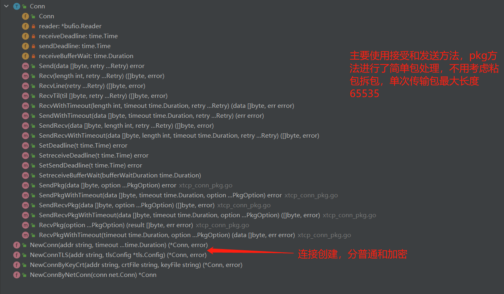
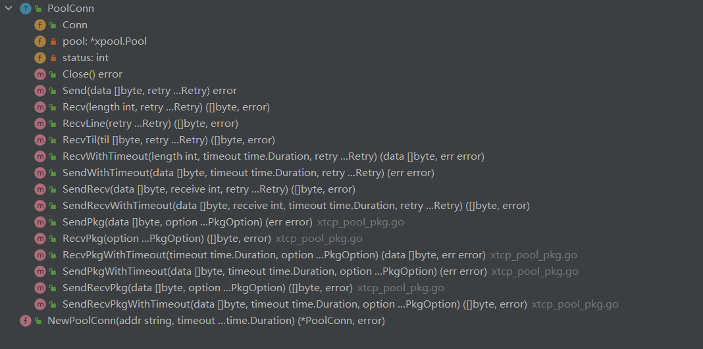

## xtcp

xtcp 是 Golang 的一个 tcp 开发组件，重新封装了 tcp 连接对象，并且提供 TLS 加密，简单消息包处理，连接池体特性。

## 快速开始

#### 服务端

```go
package main

import (
	"github.com/motai3/xtcp"
)

func main() {
	xtcp.NewServer("127.0.0.1:8999", func(conn *xtcp.Conn) {
		defer conn.Close()
		for {
			data, err := conn.Recv(-1)
			if err != nil {
				break
			}
			conn.Send(append([]byte(">"), data...))
		}
	}).Run()
}
```

上面简单实现了echo服务器，使用xtcp普通conn，一次读取所有，客户端使用telnet工具测试

```
[root@VM-20-7-centos ~]# telnet 127.0.0.1 8999
Trying 127.0.0.1...
Connected to 127.0.0.1.
Escape character is '^]'.
hello
> hello
hi there
> hi there
```

## 主要方法

连接对象

SendRecvPkg 方法在全双工通信时会收到其他连接的回复，需要再进行二次封装

池化连接

xtcp 提供了连接池的特性，由 PoolConn 对象实现，连接池缓存固定存活时间为600秒，连接池非常适合于频繁的短链接操作且连接并发量大的场景。他本质还是一个连接，带了池化的特性，可以复用之前的同地址的conn。